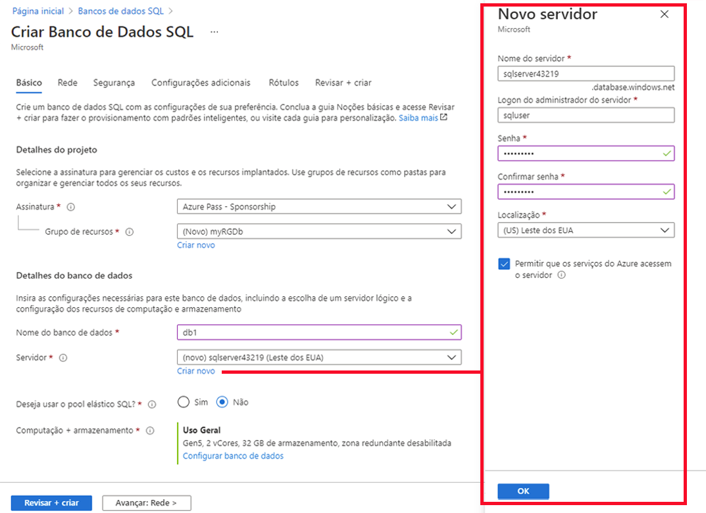
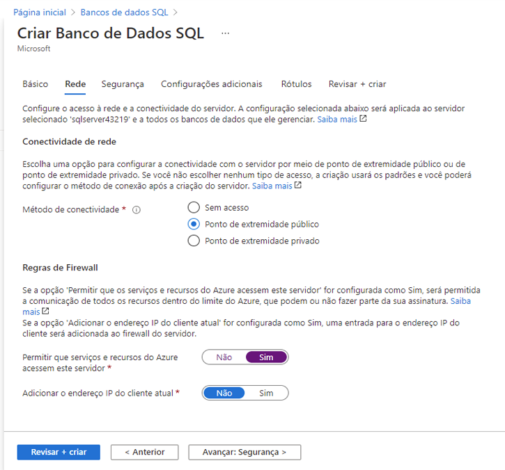
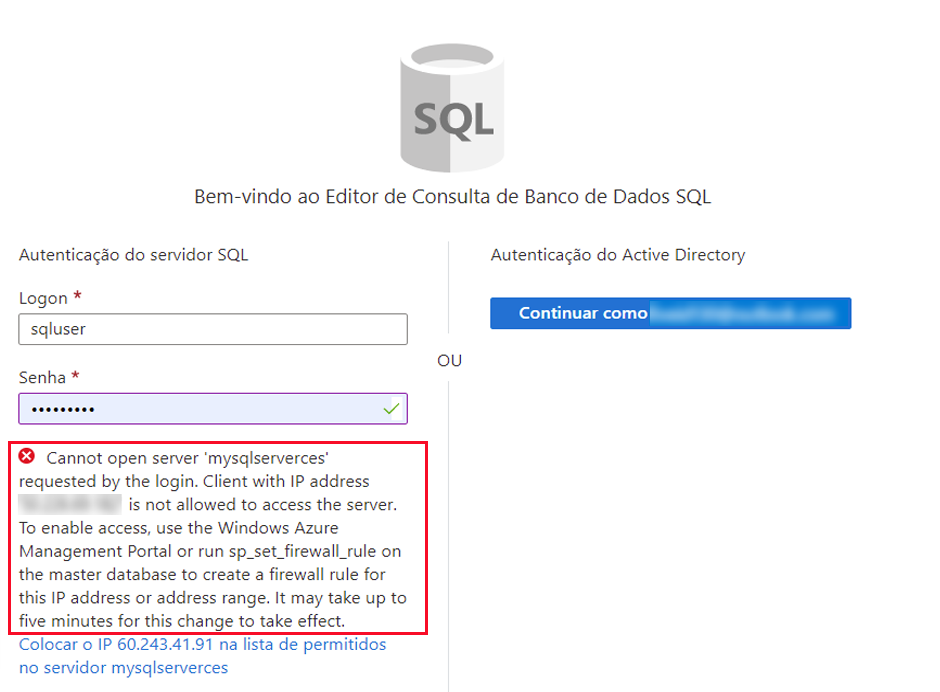
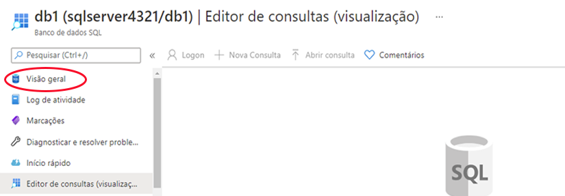
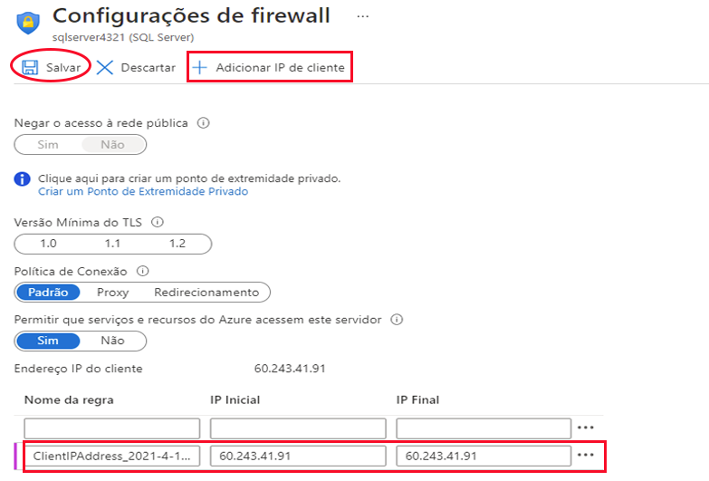
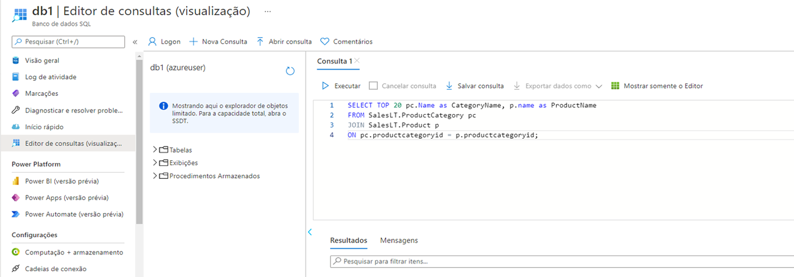

---
wts:
  title: 06 – Criar um banco de dados SQL (5 min)
  module: Module 02 - Core Azure Services (Workloads)
---

# <a name="06---create-a-sql-database-5-min"></a>06 – Criar um banco de dados SQL (5 min)

Neste passo a passo, vamos criar um banco de dados SQL no Azure e depois consultar os dados nesse banco de dados.

# <a name="task-1-create-the-database"></a>Tarefa 1: Criar o banco de dados 

Nesta tarefa, criaremos um banco de dados SQL baseado no banco de dados de exemplo AdventureWorksLT. 

1. Entre no portal do Microsoft Azure em [ **https://portal.azure.com** ](https://portal.azure.com).

2. Na folha **Todos os serviços**, procure e selecione **Bancos de dados SQL** e depois selecione **+ Adicionar, + Criar, + Novo**. 

3. Na guia **Básico**, preencha essas informações.  

    | Configuração | Valor | 
    | --- | --- |
    | Subscription | **Use a padrão fornecida** |
    | Resource group | **Criar grupo de recursos** |
    | Nome do banco de dados| **db1** | 
    | Servidor | Selecione **Criar novo** (Uma nova barra lateral será aberta à direita)|
    | Nome do servidor | **sqlserverxxxx** (deve ser exclusivo) | 
    | Location | **(EUA) Leste dos EUA** |
    | Método de autenticação | **Use Autenticação SQL** |
    | Logon de administrador do servidor | **sqluser** |
    | Senha | **Pa$$w0rd1234** |
    | Clique  | **OK** |

   

4. Na guia **Rede**, defina as configurações a seguir (deixe os outros campos com os valores padrão) 

    | Configuração | Valor | 
    | --- | --- |
    | Método de conectividade | **Ponto de extremidade público** |    
    | Permitir que serviços e recursos do Azure acessem este servidor | **Sim** |
    | Adicionar endereço IP atual do cliente | **Não** |
    
   

5. Na guia **Segurança**. 

    | Configuração | Valor | 
    | --- | --- |
    | Microsoft Defender para SQL| **Agora não** |
    
6. Vá para a guia **Configurações adicionais**. Usaremos o banco de dados de amostra AdventureWorksLT.

    | Configuração | Valor | 
    | --- | --- |
    | Usar dados existentes | **Amostra** |

    

7. Click <bpt id="p1">**</bpt>Review + create<ept id="p1">**</ept> and then click <bpt id="p2">**</bpt>Create<ept id="p2">**</ept> to deploy and provision the resource group, server, and database. It can take approx. 2 to 5 minutes to deploy.


# <a name="task-2-test-the-database"></a>Tarefa 2: Testar o banco de dados.

Nesta tarefa, vamos configurar o SQL Server e executar uma consulta SQL. 

1. When the deployment has completed, click Go to resource from the deployment blade. Alternatively, from the <bpt id="p1">**</bpt>All Resources<ept id="p1">**</ept> blade, search and select <bpt id="p2">**</bpt>Databases<ept id="p2">**</ept>, then <bpt id="p3">**</bpt>SQL databases<ept id="p3">**</ept> ensure your new database was created. You may need to <bpt id="p1">**</bpt>Refresh<ept id="p1">**</ept> the page.

    

2. Click the <bpt id="p1">**</bpt>db1<ept id="p1">**</ept> entry representing the SQL database you created. On the db1 blade click <bpt id="p1">**</bpt>Query editor (preview)<ept id="p1">**</ept>.

3. Faça logon como **sqluser** com a senha **Pa$$w0rd1234**.

4. You will not be able to login. Read the error closely and make note of the IP address that needs to be allowed through the firewall. 

    

5. De volta à folha **db1**, selecione **Visão geral**. 

    

6. Na folha **Visão geral** do db1, selecione **Definir firewall do servidor** no centro superior da tela.

7. Click <bpt id="p1">**</bpt>+ Add client IP<ept id="p1">**</ept> (top menu bar) to add the IP address referenced in the error. (it may have autofilled for you - if not paste it into the IP address fields). Be sure to <bpt id="p1">**</bpt>Save<ept id="p1">**</ept> your changes. 

    

8. Return to your SQL database (slide the bottom toggle bar to the left) and click on <bpt id="p1">**</bpt>Query Editor (Preview)<ept id="p1">**</ept>. Try to login again as <bpt id="p1">**</bpt>sqluser<ept id="p1">**</ept> with the password <bpt id="p2">**</bpt>Pa$$w0rd1234<ept id="p2">**</ept>. This time you should succeed. Note that it may take a couple of minutes for the new firewall rule to be deployed. 

9. Once you log in successfully, the query pane appears. Enter the following query into the editor pane. 

    ```SQL
    SELECT TOP 20 pc.Name as CategoryName, p.name as ProductName
    FROM SalesLT.ProductCategory pc
    JOIN SalesLT.Product p
    ON pc.productcategoryid = p.productcategoryid;
    ```

    

10. Click <bpt id="p1">**</bpt>Run<ept id="p1">**</ept>, and then review the query results in the <bpt id="p2">**</bpt>Results<ept id="p2">**</ept> pane. The query should run successfully.

    

Congratulations! You have created a SQL database in Azure and successfully queried the data in that database.

<bpt id="p1">**</bpt>Note<ept id="p1">**</ept>: To avoid additional costs, you can optionally remove this resource group. Search for resource groups, click your resource group, and then click <bpt id="p1">**</bpt>Delete resource group<ept id="p1">**</ept>. Verify the name of the resource group and then click <bpt id="p1">**</bpt>Delete<ept id="p1">**</ept>. Monitor the <bpt id="p1">**</bpt>Notifications<ept id="p1">**</ept> to see how the delete is proceeding.
