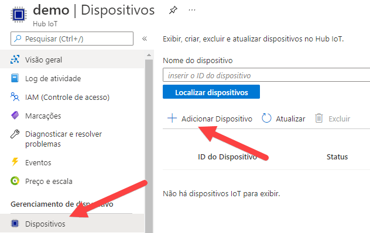
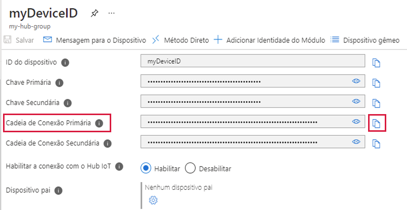

---
wts:
  title: 07 – Implementar um Hub IoT do Azure (10 min)
  module: 'Module 03: Describe core solutions and management tools'
---
# 07 – Implementar um Hub IoT do Azure (10 min)

In this walkthrough, we will configure a new Azure IoT Hub in Azure Portal, and then authenticate a connection to an IoT device using the online Raspberry Pi device simulator. Sensor data and messages are passed from the Raspberry Pi simulator to your Azure IoT Hub, and you view metrics for the messaging activity in Azure Portal.

# Tarefa 1: Criar um hub IoT 

Nesta tarefa, criaremos um hub IoT. 

1. Entre no [portal do Azure](https://portal.azure.com).

2. Na folha **Todos os serviços**, procure e selecione **Hub IoT** e depois selecione **+ Adicionar, + Criar, + Novo**.

3. Na guia **Básico** da folha **Hub IoT**, preencha os campos com os seguintes detalhes (substitua **xxxx** no nome da conta de armazenamento por letras e dígitos de forma que o nome seja globalmente exclusivo):

    | Configurações | Valor |
    |--|--|
    | Subscription | **Manter o padrão fornecido** |
    | Grupo de recursos | **Criar grupo de recursos** |
    | Nome do Hub IoT | **my-hub-groupxxxxx** |
    | Região | **Leste dos EUA** |

    **Observação**Lembre-se de alterar o **xxxxx** para ter um **Nome do Hub IoT** exclusivo.

4. Vá para a guia **Gerenciamento** e use a lista suspensa para definir o **Preço e o nível de escala** como **S1: Camada Standard**.

5. Clique no botão **Examinar + criar**.

6. Clique no botão **Criar** para começar a criar sua nova instância do Hub IoT do Azure.

7. Aguarde até que a instância do Hub IoT do Azure seja implantada. 

# Tarefa 2: Adicionar um dispositivo IoT

Nesta tarefa, adicionaremos um dispositivo IoT ao Hub IoT. 

1. When the deployment has completed, click <bpt id="p1">**</bpt>Go to resource<ept id="p1">**</ept> from the deployment blade. Alternatively, from the <bpt id="p1">**</bpt>All services<ept id="p1">**</ept> blade, search for and select <bpt id="p2">**</bpt>IoT Hub<ept id="p2">**</ept> and locate your new IoT Hub instance

    

2. To add a new IoT device, scroll down to the <bpt id="p1">**</bpt>Device management<ept id="p1">**</ept> section and click <bpt id="p2">**</bpt>Devices<ept id="p2">**</ept>. Then, click <bpt id="p1">**</bpt>+ Add Device<ept id="p1">**</ept>.

    

3. Os dados e mensagens do sensor são transmitidos do simulador Raspberry Pi para o Hub IoT do Azure, e você visualiza as métricas para a atividade de mensagens no portal do Azure.

4. Caso não veja seu novo dispositivo, **Atualize** a página Dispositivos IoT. 

5. Select <bpt id="p1">**</bpt>myRaspberryPi<ept id="p1">**</ept> and copy the <bpt id="p2">**</bpt>Primary Connection String<ept id="p2">**</ept> value. You will use this key in the next task to authenticate a connection to the Raspberry Pi simulator.

    

# Tarefa 3: Testar o dispositivo usando o Simulador Raspberry Pi

Nesta tarefa, testaremos nosso dispositivo usando o Simulador Raspberry Pi. 

1. Open a new tab in the web browser and type this shortcut link <ph id="ph1">https://aka.ms/RaspPi</ph>. It will take you to a Raspberry Pi Simulator site. If you have time, read about the Raspberry Pi simulator. When done select "<bpt id="p1">**</bpt>X<ept id="p1">**</ept>" to close the pop-up window.

2. In the code area on the right side, locate the line with 'const connectionString ='. Replace it with the connection string you copied from the Azure portal. Note that the connection sting includes the DeviceId (<bpt id="p1">**</bpt>myRaspberryPi<ept id="p1">**</ept>) and SharedAccessKey entries.

    

3. Click <bpt id="p1">**</bpt>Run<ept id="p1">**</ept> (below the code area) to run the application. The console output should show the sensor data and messages that are sent from the Raspberry Pi simulator to your Azure IoT Hub. Data and messages are sent each time the Raspberry Pi simulator LED flashes. 

    

5. Clique em **Parar** para parar de enviar dados.

6. Retorne ao portal do Azure.

7. Switch the IoT Hub <bpt id="p1">**</bpt>Overview<ept id="p1">**</ept> blade and scroll down to the <bpt id="p2">**</bpt>IoT Hub Usage<ept id="p2">**</ept> information to view usage. Change your timeframe in the <bpt id="p1">**</bpt>show data for last<ept id="p1">**</ept> to see data in the last hour.

    

Congratulations! You have set up Azure IoT Hub to collect sensor data from an IoT device.

<bpt id="p1">**</bpt>Note<ept id="p1">**</ept>: To avoid additional costs, you can optionally remove this resource group. Search for resource groups, click your resource group, and then click <bpt id="p1">**</bpt>Delete resource group<ept id="p1">**</ept>. Verify the name of the resource group and then click <bpt id="p1">**</bpt>Delete<ept id="p1">**</ept>. Monitor the <bpt id="p1">**</bpt>Notifications<ept id="p1">**</ept> to see how the delete is proceeding.
