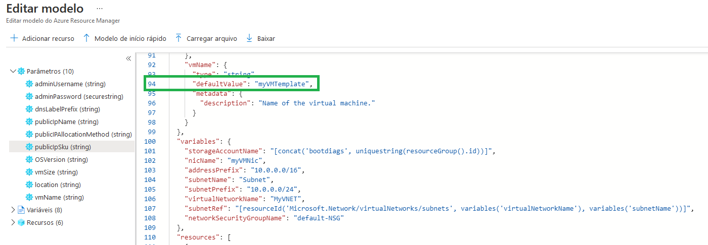
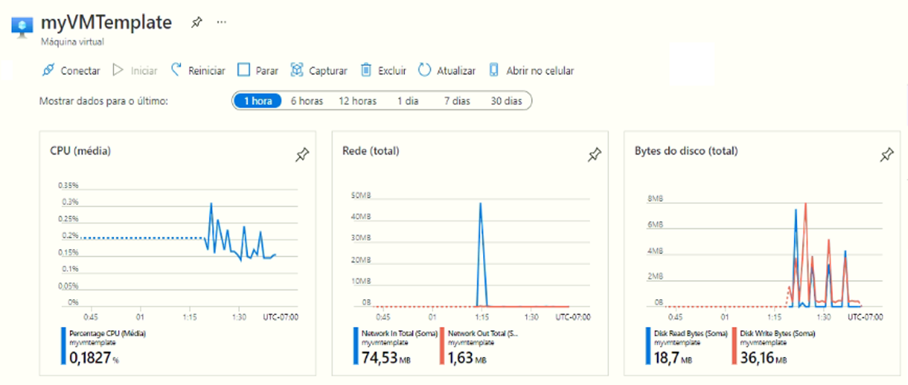
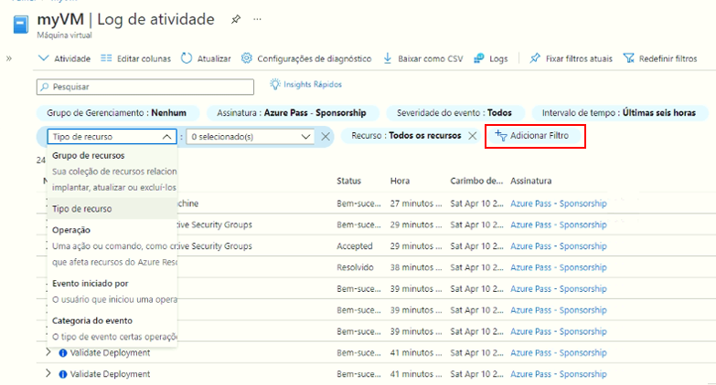

---
wts:
  title: 09 – Criar VM com um Modelo (10 min)
  module: 'Module 03: Describe core solutions and management tools'
---
# 09 – Criar VM com um Modelo (10 min)

Neste passo a passo, implantaremos uma máquina virtual com um modelo de início rápido e examinaremos os recursos de monitoramento.

# Tarefa 1: Explorar a galeria de Início Rápido e encontrar um modelo 

Nesta tarefa, navegaremos na galeria de início rápido do Azure e implantaremos um modelo que cria uma máquina virtual. 

1. Within the lab environment, open a new browser window, and enter T <ph id="ph1">https://azure.microsoft.com/en-us/resources/templates/?azure-portal=true</ph>. In the gallery you will find a number of popular and recently updated templates. These templates automate deployment of Azure resources, including installation of popular software packages. Browse through the many different types of templates that are available.

3. Selecione **Implantar VM simples do Windows**

4. Click the <bpt id="p1">**</bpt>Deploy to Azure<ept id="p1">**</ept> button. Your browser session will be automatically redirected to the <bpt id="p1">[</bpt>Azure portal<ept id="p1">](http://portal.azure.com/)</ept>.

  <bpt id="p1">**</bpt>Note<ept id="p1">**</ept>: The <bpt id="p2">**</bpt>Deploy to Azure<ept id="p2">**</ept> button enables you to deploy the template via the Azure portal. During such deployment, you will be prompted only for small set of configuration parameters. 

5. Quando solicitado, entre em sua assinatura do Azure usando as credenciais fornecidas anteriormente nas instruções.

6. Click <bpt id="p1">**</bpt>Edit template<ept id="p1">**</ept>. The Resource Manager template format uses the JSON format. Review the parameters and variables.  Then locate the parameter for virtual machine name. Change the name to <bpt id="p1">**</bpt>myVMTemplate<ept id="p1">**</ept>. <bpt id="p1">**</bpt>Save<ept id="p1">**</ept> your changes. 

    

7. Now configure the parameters required by the template (replace <bpt id="p1">***</bpt>xxxx<ept id="p1">***</ept> in the DNS label prefix with letters and digits such that the label is globally unique). Leave the defaults for everything else. 

    | Configuração| Valor|
    |----|----|
    | Subscription | **Manter o padrão fornecido**|
    | Resource group | **Criar grupo de recursos** |
    | Região | mantenha o padrão  |
    | Nome de usuário do administrador | **azureuser** |
    | Senha de administrador | **Pa$$w0rd1234** |
    | Prefixo da etiqueta de DNS | **myvmtemplatexxxx** |
    | Versão do SO | **2019-Datacenter** |

9. Clique em **Revisar + Criar**.

10. Monitore sua implantação. 

# Tarefa 2: Verificar e monitorar a implantação de sua máquina virtual

Nesta tarefa, vamos verificar a máquina virtual implantada corretamente. 

1. Na folha **Todos os serviços**, procure e selecione **Máquinas virtuais**.

2. Certifique-se de que sua nova máquina virtual foi criada. 

    

3. Selecione sua máquina virtual e, no painel **Visão geral**, selecione a guia **Monitoramento**. Role para baixo para visualizar os dados de monitoramento.

    **Observação**: O período de monitoramento pode ser ajustado de uma hora até 30 dias.

4. Revise os diferentes gráficos fornecidos, incluindo **CPU (média)** , **Rede (total)** e **Bytes de disco (total)** . 

    

5. No ambiente de laboratório, abra uma nova janela do navegador e digite T https://azure.microsoft.com/en-us/resources/templates/?azure-portal=true.

6. Na galeria, você encontrará vários modelos populares e atualizados recentemente.
7. Esses modelos automatizam a implantação de recursos do Azure, incluindo a instalação de pacotes de software populares. 

8. Clique em **Adicionar filtro** e experimente pesquisar diferentes tipos de eventos e operações. 

    

Navegue pelos diversos tipos de modelos disponíveis.

<bpt id="p1">**</bpt>Note<ept id="p1">**</ept>: To avoid additional costs, you can optionally remove this resource group. Search for resource groups, click your resource group, and then click <bpt id="p1">**</bpt>Delete resource group<ept id="p1">**</ept>. Verify the name of the resource group and then click <bpt id="p1">**</bpt>Delete<ept id="p1">**</ept>. Monitor the <bpt id="p1">**</bpt>Notifications<ept id="p1">**</ept> to see how the delete is proceeding.
