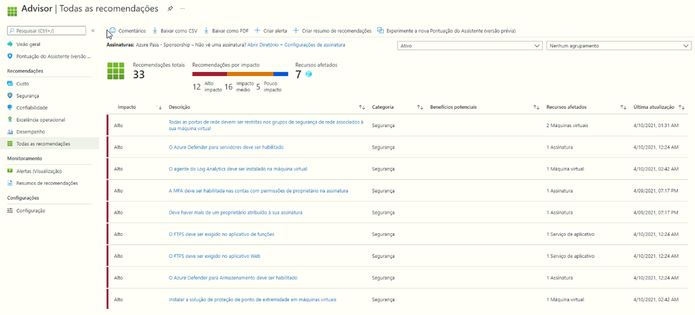

---
wts:
  title: 11 – Criar VM com a CLI (10 min)
  module: 'Module 03: Describe core solutions and management tools'
---
# <a name="11---create-a-vm-with-the-cli-10-min"></a>11 – Criar VM com a CLI (10 min)

Neste passo a passo, vamos configurar o Cloud Shell, usar a CLI do Azure para criar um grupo de recursos e máquina virtual e revisar as recomendações do Assistente do Azure. 

# <a name="task-1-configure-the-cloud-shell"></a>Tarefa 1: Configurar o Cloud Shell 

Nesta tarefa, vamos configurar o Cloud Shell e usar a CLI do Azure para criar um grupo de recursos e uma máquina virtual.  

1. Entre no [portal do Azure](https://portal.azure.com).

2. No portal do Azure, abra o **Azure Cloud Shell** clicando no ícone no canto superior direito do portal do Azure.

    
   
3. Na caixa de diálogo Bem-vindo ao Azure Cloud Shell, quando for solicitado para selecionar **Bash** ou **PowerShell**, selecione **Bash**. 

4. A new window will open stating <bpt id="p1">**</bpt>You have no storage mounted<ept id="p1">**</ept>. Select <bpt id="p1">**</bpt>advanced settings<ept id="p1">**</ept>.

5. Na tela de configurações avançadas, preencha os campos a seguir e depois selecione Criar Armazenamento:
    - Grupo de Recursos: **Criar grupo de recursos**
    - Conta de Armazenamento: crie uma conta nova e use um nome globalmente exclusivo (ex.: cloudshellxyzstorage)
    - Compartilhamento de Arquivos: Crie um novo e dê a ele o nome cloudshellfileshare


# <a name="task-2-use-cli-to-create-a-virtual-machine"></a>Tarefa 2: Usar a CLI para criar uma máquina virtual

Nesta tarefa, usaremos a CLI do Azure para criar um grupo de recursos e uma máquina virtual.

1. Certifique-se de que o **Bash** esteja selecionado no menu suspenso superior esquerdo do painel do Cloud Shell (se não estiver selecionado, selecione-o).

    


2. Verifique o grupo de recursos sendo usado digitando o seguinte comando.

    ```cli
    az group list --output table
    ```

4. In Cloud Shell enter the command below and make sure that each line, except for the last one, is followed by the backslash (<ph id="ph1">`\`</ph>) character. If you type the whole command on the same line, do not use any backslash characters. 

    ```cli
    az vm create \
    --name myVMCLI \
    --resource-group myRGCLI \
    --image UbuntuLTS \
    --location EastUS2 \
    --admin-username azureuser \
    --admin-password Pa$$w0rd1234
    ```

    >**Observação**: Se você estiver usando a linha de comando em um computador Windows, substitua o caractere de barra invertida (`\`) pelo acento circunflexo (`^`).

    <bpt id="p1">**</bpt>Note<ept id="p1">**</ept>: The command will take 2 to 3 minutes to complete. The command will create a virtual machine and various resources associated with it such as storage, networking and security resources. Do not continue to the next step until the virtual machine deployment is complete. 

5. Quando o comando terminar de ser executado, na janela do navegador, feche o painel do Cloud Shell.

6. No portal do Azure, procure **Máquinas virtuais** e verifique se **myVMCLI** está em execução.

    


# <a name="task-3-execute-commands-in-the-cloud-shell"></a>Tarefa 3: Executar comandos no Cloud Shell

Nesta tarefa, praticaremos a execução de comandos CLI do Cloud Shell. 

1. No portal do Azure, abra o **Azure Cloud Shell** clicando no ícone no canto superior direito do portal do Azure.

2. Certifique-se de que **Bash** esteja selecionado no menu suspenso superior esquerdo do painel do Cloud Shell.

3. Retrieve information about the virtual machine you provisioned, including name, resource group, location, and status. Notice the PowerState is <bpt id="p1">**</bpt>running<ept id="p1">**</ept>.

    ```cli
    az vm show --resource-group myRGCLI --name myVMCLI --show-details --output table 
    ```

4. Stop the virtual machine. Notice the message that billing continues until the virtual machine is deallocated. 

    ```cli
    az vm stop --resource-group myRGCLI --name myVMCLI
    ```

5. Verify your virtual machine status. The PowerState should now be <bpt id="p1">**</bpt>stopped<ept id="p1">**</ept>.

    ```cli
    az vm show --resource-group myRGCLI --name myVMCLI --show-details --output table 
    ```

# <a name="task-4-review-azure-advisor-recommendations"></a>Tarefa 4: Analisar recomendações do Assistente do Azure

Nesta tarefa, revisaremos as recomendações do Assistente do Azure.

   **Observação:** Se você concluiu o laboratório anterior (Criar uma VM com o PowerShell), você já executou esta tarefa. 

1. Na folha **Todos os serviços**, procure e selecione **Assistente**. 

2. On the <bpt id="p1">**</bpt>Advisor<ept id="p1">**</ept> blade, select <bpt id="p2">**</bpt>Overview<ept id="p2">**</ept>. Notice recommendations are grouped by Reliability, Security, Performance, and Cost. 

    

3. Selecione **Todas as recomendações** e reserve um tempo para ver cada recomendação e as ações sugeridas. 

    **Observação:** Dependendo de seus recursos, suas recomendações serão diferentes. 

    

4. Observe que você pode baixar as recomendações como um arquivo CSV ou PDF. 

5. E também pode criar alertas. 

6. Se você tiver tempo, continue experimentando a CLI do Azure. 

Congratulations! You have configured Cloud Shell, created a virtual machine using Azure CLI, practiced with Azure CLI commands, and viewed Advisor recommendations.

<bpt id="p1">**</bpt>Note<ept id="p1">**</ept>: To avoid additional costs, you can optionally remove this resource group. Search for resource groups, click your resource group, and then click <bpt id="p1">**</bpt>Delete resource group<ept id="p1">**</ept>. Verify the name of the resource group and then click <bpt id="p1">**</bpt>Delete<ept id="p1">**</ept>. Monitor the <bpt id="p1">**</bpt>Notifications<ept id="p1">**</ept> to see how the delete is proceeding.
