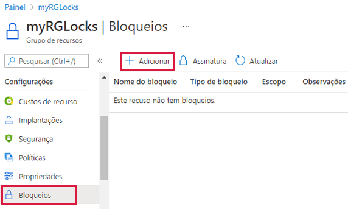

---
wts:
  title: 15 – Gerenciar bloqueios de recursos (5 min)
  module: 'Module 05: Describe identity, governance, privacy, and compliance features'
---
# 15 – Gerenciar bloqueios de recursos (5 min)

In this walkthrough, we will add a lock to the resource group and test deleting the resource group. Locks can be applied in a subscription to resource groups, or individual resources to prevent accidental deletion or modification of critical resources.  

# Tarefa 1:  Adicionar um bloqueio ao grupo de recursos e testar a exclusão

Nesta tarefa, adicionaremos um bloqueio de recurso ao grupo de recursos e testaremos a exclusão do grupo. 

1. Entre no [portal do Azure](https://portal.azure.com).

2. No portal do Azure, navegue até o grupo de recursos **myRGLocks**.

3. Você pode aplicar um bloqueio a uma assinatura, grupo de recursos ou recurso individual para evitar exclusão acidental ou modificação de recursos críticos. 

4. Na seção **Configurações**, clique em **Bloqueios** e em **+Adicionar**. 

    

5. Configure the new lock. When you are done click <bpt id="p1">**</bpt>OK<ept id="p1">**</ept>. 

    | Configuração | Valor |
    | -- | -- |
    | Nome do bloqueio | '''RGLock''’ |
    | Tipo de bloqueio | **Excluir** |
    | | |

6. Click <bpt id="p1">**</bpt>Overview<ept id="p1">**</ept> and click <bpt id="p2">**</bpt>Delete resource group<ept id="p2">**</ept>. Type the name of the resource group and click <bpt id="p1">**</bpt>OK<ept id="p1">**</ept>. You receive an error message stating the resource group is locked and can't be deleted.

    

# Tarefa 2: Testar a exclusão de um membro do grupo de recursos

Nesta tarefa, testaremos se o bloqueio de recursos protege uma conta de armazenamento no grupo de recursos. 

1. Na folha **Todos os serviços**, procure e selecione **Contas de armazenamento** e, em seguida, clique em **+ Adicionar, + Criar ou + Novo**. 

2. Neste passo a passo, vamos adicionar um bloqueio ao grupo de recursos e testar a exclusão do grupo de recursos.

    | Configuração | Valor | 
    | --- | --- |
    | Assinatura | **Selecione sua assinatura** |
    | Resource group | **myRGLocks** |
    | Nome da conta de armazenamento | **storageaccountxxxx** |
    | Location | **(EUA) Leste dos EUA**  |
    | Desempenho | **Standard** |
    | Tipo de conta | **StorageV2 (v2 de uso geral)** |
    | Replicação | **LRS (armazenamento com redundância local)** |
    | Camada de acesso (padrão) | **Frequente** |
   

3. Clique em **Revisar + Criar** para revisar as configurações da sua conta de armazenamento e permitir que o Azure valide a configuração. 

4. Os bloqueios podem ser aplicados em uma assinatura de grupos de recursos ou recursos individuais para evitar exclusão acidental ou modificação de recursos críticos. 

5.  Aguarde a notificação de que a conta de armazenamento foi criada com sucesso. 

6. Access your new storage account and from the <bpt id="p1">**</bpt>Overview<ept id="p1">**</ept> pane, click <bpt id="p2">**</bpt>Delete<ept id="p2">**</ept>. You receive an error message stating the resource or its parent has a delete lock. 

    

    <bpt id="p1">**</bpt>Note<ept id="p1">**</ept>: Although we did not create a lock specifically for the storage account, we did create a lock at the resource group level, which contains the storage account. As such, this <bpt id="p1">*</bpt>parent<ept id="p1">*</ept> level lock prevents us from deleting the resource and the storage account inherits the lock from the parent.

# Tarefa 3: Remover o bloqueio de recursos

Nesta tarefa, vamos remover o bloqueio de recursos e testar. 

1. Retorne à folha do grupo de recursos **myRGLocks-XXXXXXXX** e, na seção **Configurações**, clique em **Bloqueios**.
    
2. Clique no link **Excluir** à direita da entrada **myRGLocks-XXXXXXXX**, à direita de **Editar**.

    

3. Volte para a folha da conta de armazenamento e confirme que agora você pode excluir o recurso.

Congratulations! You created a resource group, added a lock to resource group and tested deletion, tested deleting a resource in the resource group, and removed the resource lock. 

<bpt id="p1">**</bpt>Note<ept id="p1">**</ept>: To avoid additional costs, you can optionally remove this resource group. Search for resource groups, click your resource group, and then click <bpt id="p1">**</bpt>Delete resource group<ept id="p1">**</ept>. Verify the name of the resource group and then click <bpt id="p1">**</bpt>Delete<ept id="p1">**</ept>. Monitor the <bpt id="p1">**</bpt>Notifications<ept id="p1">**</ept> to see how the delete is proceeding.
