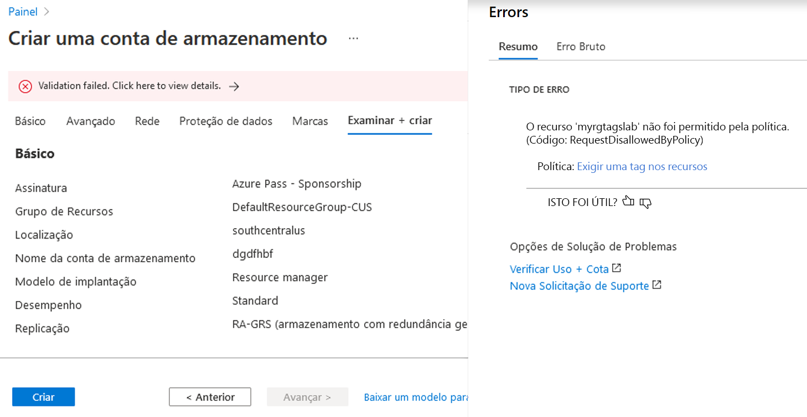
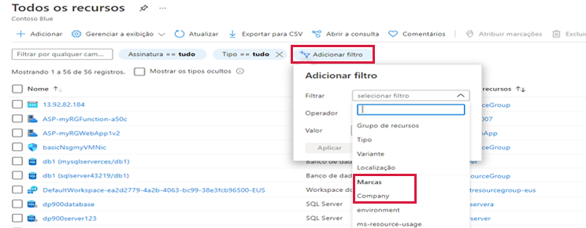

---
wts:
  title: 16 – Implantar marcação de recursos (5 min)
  module: 'Module 05: Describe identity, governance, privacy, and compliance features'
---
# 16 – Implantar marcação de recursos (5 min)

Neste passo a passo, vamos criar uma atribuição de política que requer marcação, criar uma conta de armazenamento e testar a marcação, visualizar recursos com uma marcação especificada e remover a política de marcação.

# Tarefa 1: Criar atribuição de Política 

Nesta tarefa, vamos configurar a política **Exigir uma marca nos recursos** e atribuí-la à nossa assinatura. 

1. Entre no [portal do Azure](https://portal.azure.com).

2. Na folha **Todos os serviços**, procure e selecione **Política**.

3. Role para baixo até a seção **Criação**, clique em **Atribuições** e, em seguida, clique em **Atribuir política** na parte superior da página.

4. Observe que o **Escopo** de nossa política abrange toda a assinatura. 

5. Under <bpt id="p1">**</bpt>Basics<ept id="p1">**</ept> Select the <bpt id="p2">**</bpt>Policy definition<ept id="p2">**</ept> ellipsis button (right side of textbox). In the <bpt id="p1">**</bpt>Search<ept id="p1">**</ept> box, enter the value <bpt id="p2">**</bpt>tag<ept id="p2">**</ept>. A list of related Policies with the word <bpt id="p1">**</bpt>tag<ept id="p1">**</ept> will appear. Scroll down till you find the <bpt id="p1">**</bpt>Require a tag and its value on resources<ept id="p1">**</ept> definition, click on it and click <bpt id="p2">**</bpt>Select<ept id="p2">**</ept>.

   
   
6.  On the <bpt id="p1">**</bpt>Parameters<ept id="p1">**</ept> tab, type in **Company : Contoso ** for the tag key/value pair name. Click <bpt id="p1">**</bpt>Review + create<ept id="p1">**</ept>, and then <bpt id="p2">**</bpt>Create<ept id="p2">**</ept>.

  

7. The <bpt id="p1">**</bpt>Require a tag amd its value on resources<ept id="p1">**</ept> policy assignment is now in place. When a resource is created, it must include a tag with the Company : Contoso key.
   <bpt id="p1">**</bpt>Note - you need to wait up to 30 minutes for the Policy to be applied.<ept id="p1">**</ept> 

  

# Tarefa 2: Criar uma conta de armazenamento para testar a marcação necessária

Nesta tarefa, criaremos contas de armazenamento para testar a marcação necessária. 

1. No portal do Azure, na folha **Todos os serviços**, procure e selecione **Contas de armazenamento** e, em seguida, selecione **+Adicionar +Nova +Criar**.

2. On the <bpt id="p1">**</bpt>Basics<ept id="p1">**</ept> tab of the <bpt id="p2">**</bpt>Create storage account<ept id="p2">**</ept> blade, fill in the following information (replace <bpt id="p3">**</bpt>xxxx<ept id="p3">**</ept> in the name of the storage account with letters and digits such that the name is globally unique). Leave the defaults for everything else.

    | Configuração | Valor | 
    | --- | --- |
    | Subscription | **Use o padrão fornecido** |
    | Resource group | **Criar grupo de recursos** |
    | Nome da conta de armazenamento | **storageaccountxxxx** |
    | Location | **(EUA) Leste dos EUA** |

3. Clique em **Revisar + Criar**. 

    <bpt id="p1">**</bpt>Note:<ept id="p1">**</ept> We are testing to see what happens when the tag is not supplied. Please note, it can take up to 30 minutes for Policies to take effect.

4. You will receive a Validation failed message. Click the <bpt id="p1">**</bpt>Click here to view details<ept id="p1">**</ept> message. On the <bpt id="p1">**</bpt>Errors<ept id="p1">**</ept> blade, on the <bpt id="p2">**</bpt>Summary<ept id="p2">**</ept> tab note the error message stating that resource was disallowed by Policy.

    **Observação:** Se você visualizar a guia Erro bruto, verá o nome da marca específico necessário. 

    

5. Close the <bpt id="p1">**</bpt>Error<ept id="p1">**</ept> pane and click <bpt id="p2">**</bpt>Previous<ept id="p2">**</ept> (bottom of the screen). Provide the tagging information. 

    | Configuração | Valor | 
    | --- | --- |
    | Nome da marca | **Empresa:Contoso** (pode não estar na lista suspensa) |

6. Click <bpt id="p1">**</bpt>Review + create<ept id="p1">**</ept> and verify that the validation was successful. Click <bpt id="p1">**</bpt>Create<ept id="p1">**</ept> to deploy the storage account. 

# Tarefa 3: Veja todos os recursos com uma marca específica

1. No portal do Azure, na folha **Todos os serviços**, procure e selecione **Marcas**.

2. Note all tags and their values. Click the <bpt id="p1">**</bpt>Company : Contoso<ept id="p1">**</ept> key/value pair. This will display a blade showing the newly created storage account, as long as you included the tag during its deployment. 

   

3. No Portal, exiba a folha **Todos os recursos**.

4. Click <bpt id="p1">**</bpt>Add filter<ept id="p1">**</ept> and add the <bpt id="p2">**</bpt>Company<ept id="p2">**</ept> tag key as the filter category. With the filter applied, only your storage account will be listed.

    

# Tarefa 4: Excluir a atribuição de política

Nesta tarefa, removeremos a política **Exigir uma marca nos recursos** para que ela não afete nosso trabalho futuro. 

1. No portal, na folha **Todos os serviços**, procure e selecione **Política**.

2. Clique na entrada de política **Exigir uma marca nos recursos**.

3. Clique em **Excluir atribuição** no menu superior.

4. Confirme que deseja excluir a atribuição de política na caixa de diálogo **Excluir atribuição** clicando em **Sim**

5. Se você tiver tempo, crie outro recurso sem uma marca para garantir que a política não esteja mais em vigor.

Em **Básico**, selecione o botão de reticências **Definição de política** (lado direito da caixa de texto).

Na caixa **Pesquisar**, insira a **marca** de valor.
