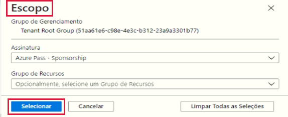
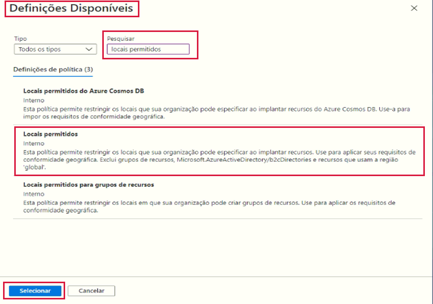
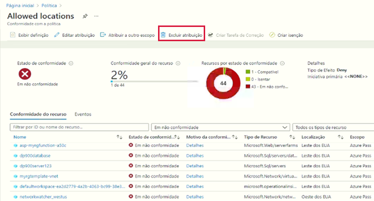

---
wts:
  title: 17 – Criar Azure Policy (10 min)
  module: 'Module 05: Describe identity, governance, privacy, and compliance features'
---
# 17 – Criar Azure Policy (10 min)

Neste passo a passo, criaremos uma Azure Policy para restringir a implantação dos recursos do Azure em um local específico.

# Tarefa 1: Criar atribuição de Política 

Nesta tarefa, vamos configurar a política de localização permitida e atribuí-la à nossa assinatura. 

1. Entre no [portal do Azure](https://portal.azure.com).

2. From the <bpt id="p1">**</bpt>All services<ept id="p1">**</ept> blade, search for and select <bpt id="p2">**</bpt>Policy<ept id="p2">**</ept>, under the <bpt id="p3">**</bpt>Authoring<ept id="p3">**</ept> section click <bpt id="p4">**</bpt>Definitions<ept id="p4">**</ept>.  Take a moment to review the list of built-in policy definitions. For example, in the <bpt id="p1">**</bpt>Category<ept id="p1">**</ept> drop-down select only <bpt id="p2">**</bpt>Compute<ept id="p2">**</ept>. Notice the <bpt id="p1">**</bpt>Allowed virtual machine size SKUs<ept id="p1">**</ept> definition enables you to specify a set of virtual machine SKUs that your organization can deploy.

3. Return to the <bpt id="p1">**</bpt>Policy<ept id="p1">**</ept> page, under the <bpt id="p2">**</bpt>Authoring<ept id="p2">**</ept> section click <bpt id="p3">**</bpt>Assignments<ept id="p3">**</ept>. An assignment is a policy that has been assigned to take place within a specific scope. For example, a definition could be assigned to the subscription scope. 

4. Clique em **Atribuir política** na parte superior da página **Política – Atribuições**.

5. Na página **Atribuir Política**, mantenha o Escopo padrão.

      | Configuração | Valor | 
    | --- | --- |
    | Escopo| **Use o padrão selecionado**|
    | Definição de política | selecione as reticências, pesquise **Locais Permitidos** e pressione **Selecionar** |
    | Nome da Atribuição | **Locais permitidos** |
    
    
6. On the <bpt id="p1">**</bpt>Parameters<ept id="p1">**</ept> tab, select <bpt id="p2">**</bpt>Japan West<ept id="p2">**</ept>. Click <bpt id="p1">**</bpt>Review + create<ept id="p1">**</ept>, and then <bpt id="p2">**</bpt>Create<ept id="p2">**</ept>.

    <bpt id="p1">**</bpt>Note<ept id="p1">**</ept>: A scope determines what resources or grouping of resources the policy assignment applies to. In our case we could assign this policy to a specific resource group, however we chose to assign the policy at subscription level. Be aware that resources can be excluded based on the scope configuration. Exclusions are optional.

    <bpt id="p1">**</bpt>Note<ept id="p1">**</ept>: This <bpt id="p2">**</bpt>Allowed Locations<ept id="p2">**</ept> policy definition will specify a location into which all resources must be deployed. If a different location is chosen, deployment will not be allowed. For more information view the <bpt id="p1">[</bpt>Azure Policy Samples<ept id="p1">](https://docs.microsoft.com/en-us/azure/governance/policy/samples/index)</ept> page.

   

9. A atribuição de política de **Locais permitidos** agora está listada no painel **Política – Atribuições** e está em vigor, impondo a política no nível de escopo que especificamos (nível de assinatura).

# Tarefa 2: Testar política de localização permitida

Nesta tarefa, testaremos a política de localização permitida. 

1. No portal do Azure, na folha **Todos os serviços**, procure e selecione **Contas de armazenamento** e, em seguida, selecione **+ Criar**.

2. Configure the storage account (replace <bpt id="p1">**</bpt>xxxx<ept id="p1">**</ept> in the name of the storage account with letters and digits such that the name is globally unique). Leave the defaults for everything else. 

    | Configuração | Valor | 
    | --- | --- |
    | Subscription | **Use o padrão fornecido** |
    | Resource group | **myRGPolicy** (criar novo) |
    | Nome da conta de armazenamento | **storageaccountxxxx** |
    | Location | **(EUA) Leste dos EUA** |

3. Clique em **Revisar + criar** e, em seguida, clique em **Criar**. 

4. Você encontrará o erro de **falha de implantação** informando que o recurso não foi permitido pela política, incluindo a política **Locais permitidos**.

# Tarefa 3: Excluir a atribuição de política

Nesta tarefa, removeremos a atribuição e o teste da política de localização permitida. 

Excluiremos a atribuição de política para garantir que não seremos bloqueados em nenhum trabalho futuro que desejamos fazer.

1. Na folha **Todos os serviços**, procure e selecione **Política** e clique em sua política de **Locais permitidos**.

    **Observação**: Na folha **Política**, você pode visualizar o estado de conformidade das várias políticas atribuídas.

    <bpt id="p1">**</bpt>Note<ept id="p1">**</ept>: The Allowed location policy may show non-compliant resources. If so, these are resources created prior to the policy assignment.
 
2. Selecione **Locais Permitidos**. Será aberta uma janela de Conformidade da Política de Locais Permitidos.

3. Na folha **Todos os serviços**, procure e selecione **Política**. Na seção **Criação**, clique em **Definições**.

   

4. Tente criar outra conta de armazenamento para garantir que a política não esteja mais em vigor.

    **Observação**: Os cenários comuns em que a política de **Locais permitidos** pode ser útil incluem: 
    - Reserve um momento para revisar a lista de definições de política integradas. 
    - *Residência de dados e conformidade de segurança*: Você também pode ter requisitos de residência de dados e criar assinaturas por cliente ou cargas de trabalho específicas e definir que todos os recursos devem ser implantados em um datacenter específico para garantir os requisitos de conformidade de dados e segurança.

Por exemplo, na lista suspensa **Categoria**, selecione apenas **Calcular**.

Observe que a definição **SKUs permitidos de máquina virtual** possibilita especificar um conjunto de SKUs de máquina virtual que pode ser implantado pela sua empresa.
